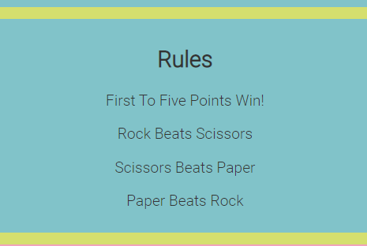

# Rock, Paper, Scissors
Rock, Paper Scissors is a fun online game to play by yourself or together with others! You play against a computer which generates a random descision and your challenge is to beat the CPU! You can sit with your friends or just play a while alone if you are bored and got some time to spare. 

## Features
 ### Existing features
* Header
  * The header, located on the top of the page displays the name of the game. Rock, paper, scissors is in generall a well known game and the user will most likely understand what the game is about just by seeing the name. If that is not the case, the rules are provided below the game area. 
  
  

* Result
  * What is first shown in this section is a promt for the user to make a choice by the text "What will you choose"
  * When the user has pressed a button below the result will be shown at the top of the game area. This will show if the computer or the user won the round.
   

  

* Images of the choices
  * When the user click a choice button the choice displays below the result area. The generated computer choice also displays.
  * As well as the text of the choice is displayed, the image also change depending on the user choice and the generated computer choice. 
   

  

* Game options
  * There are three game options, all buttons which all clearly states what choice they represent. Each button as well has an icon that represents each choice to make it even more clear
  * To make the buttons more interactive there is a hover effect on them which corresponds to the generall color theme.
     
    
     
    

* Score 
  * The score section displays yours and the computers current score.
  * When either the user score or the computer score reaches 5 the user will recive an alert box which displays who won as well as a promt to press ok to restart the game. 
  * There is also a possibility for the user to click the reset score button to make the scores go back to zero.

  

* Rules
  * If the user is not aware of the rules of the game, or just need a refresher of this, they can easily scroll down and read over the rules section which displays what will beat what in the game. 

  

* Footer
  * The footer displays an icon of the well known Wikipedia symbol. If you press this link it will open in a new tab and bring you to the Wikipedia article about rock, paper, scissors. 

  

### Features left to implement
   * When there is time I would like to implement a feature where the user will, instead of receiving an alert box, would get a result message on the site it self and not from a pop up. The javaScipt code is created in a way so that if the score of either user or computer reaches five the score will not increment. This means that if a possible message would appear on the screen it could just have a prompt to press the reset score button and the game would work just fine. 

## Design
   * The design of this site was made with with the intention of using playful colors to fit the game feeling as well as doing an easy navigate website which is user friendly and easy to use as a first time user. 
### Color Scheme
   * I overall wanted playfull colors and I implemented this by basing the color scheme of the images I used to display the user and computer choices. I used a hex color picker where I loaded up one of the images and then picked the colors from the post its in the background. Then I just used a grey color in the body (except for the Header) for contrast.
   * Yellow
    

   

   * Blue 
    

   

   * Pink
    
   
   

## Responsiveness 
   * This site use no media queries. Instead I added a width of 75 % which makes the site responive and looks good on all devices. 

## Testing
   * I tested that the game is playable on multiple browsers (chrome, firefox, safari, edge). The game works on Safari as well however the alert is not recived. The score just resets.
   * I confirmed that the game results are always correct. 
   * I confirmed that all the parts (with different colors and fonts) of the website are readable and easy to understand.
   * I confirmed that the site is responsive and works well on different screen types (Se Responiveness section above) by running a lighthouse check. 
   * No errors where found when checking the javaScript code in JsHint
    

   

### Bugs 
  #### Solved bugs
   * When I first deployed my page, the scores of the computer and user only whent up to five but you could still play the game (without the score incrementing). By setting the scores to zero when 5 was reached as well as adding the alert to make sure game is restarted this was solved. 

### Validator testing
   * HTML 
     * No errors where returned when passing through the official W3C validator.
   * CSS 
     * No errors where found when passing the CSS code through the official (Jigsaw) CSS validator.  

### Unfixed bugs
   * No unfixed bugs

## Deployment
   * The site was deployed to GitHub pages. The steps to deploy are as follows:
     * In the GitHub repository, navigate to settings.
     * From the source section drop down-menu, select the Main Branch.
     * Once the min branch has been selected, save and the page provided the link to the completed website.

live link to the website: https://aamandaericson.github.io/Rock-Paper-Scissors-/

## Credits
### Content
  * The code for the base game was inspired by a YouTube tutorial. The YouTube channel is "Code with Ania Kubów" and the video name is "3 ways to code Rock Paper Scissors in JavaScript (Beginner to Intermediate to Advanced!)". I used the beginner version as inspiration. 

    link here: https://www.youtube.com/watch?v=RwFeg0cEZvQ&t=2202s
  * I also, from this video, used the code for the generateComputerChoice() function. I then added code more code to fit my game.
### Media
   * The images for this project was taken from Unsplash by the photographer: Fadilah Im.

